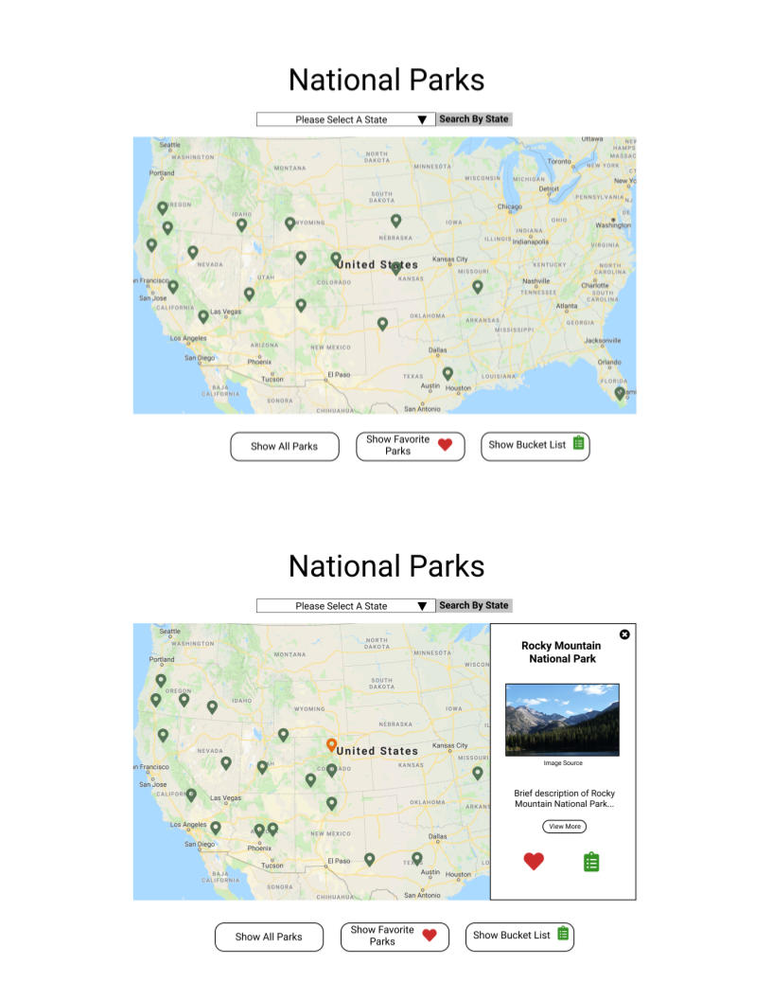
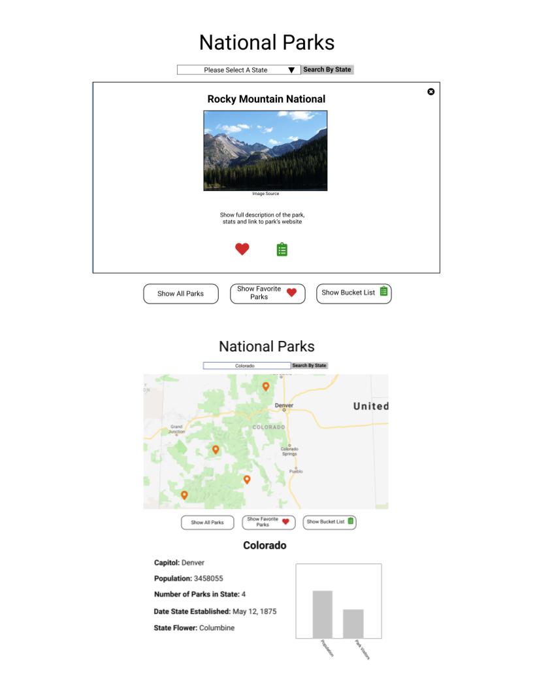

# National Parks

### See it Live!
[Mark My Parks](https://kaohman.github.io/national-parks/) on GitHub Pages
### Set-Up Front-End:
Clone this repo  
Run `npm install` from the root directory  
Run `npm start` and visit localhost:3000 in your browser

### Background / About:
There is a great deal of information available from the National Park Serivce on parks throughout the United States. However their website can be difficult to navigate through to get to a park you are interested. There is also not an option to save parks you would like to visit.  
Mark My Parks provides an easy to use interface where users can explore national parks across the United States. Users can also use the information and saving preferences below to plan future trips: 
 * Find an overview of each park including a direct link to the National Park Service's webpage for that park  
 * Save parks to their personal Bucket List or Visited Parks list 
 * View parks only in their Bucket List or Visited Parks list
### Primary Technologies Used:
 - React
 - Javascript
 - HTML
 - CSS/SCSS
 - Leaflet

### Test Driven Development:
Jest and Enzyme for front-end testing.  
Run `npm test` from the root directory
### Enhancements:
Additional enhancements we would like to include in the future
* Functionality to plan/save a trip export route between parks to Google Maps  
* Add Geolocation API to find parks near your current location  
* Include additional monuments and historic sites run by the National Park Service and parks in other countries  
* Ability for users login to rate and comment on parks they have visited.
* Ability for search by park name
### Preview:

### Original Assignment:
[Whateverly](http://frontend.turing.io/projects/whateverly.html) project from Turing School of Software and Design

### DTR Memo:
https://gist.github.com/trbachmann/ceb360e8cf0d946281cdba7091e4e484

### Contributors:
[Karin Ohman](https://github.com/kaohman)  
[Adam Niedzwiecki](https://github.com/AdamN8142)  
[Tiffany Bachmann](https://github.com/trbachmann)

### Wireframes:
  
