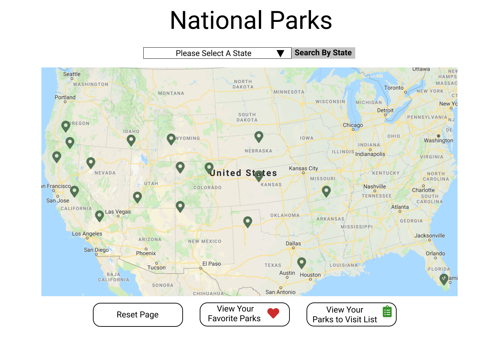
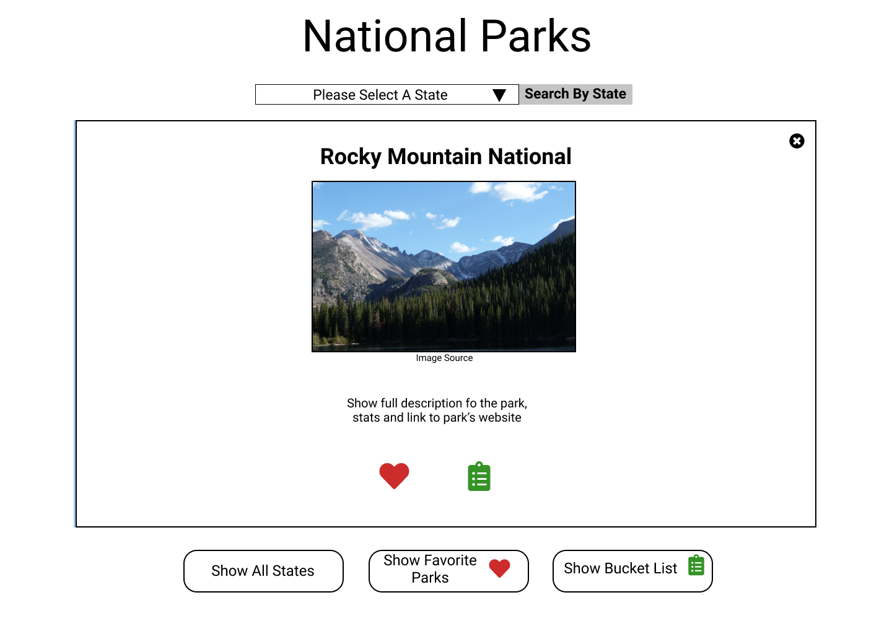
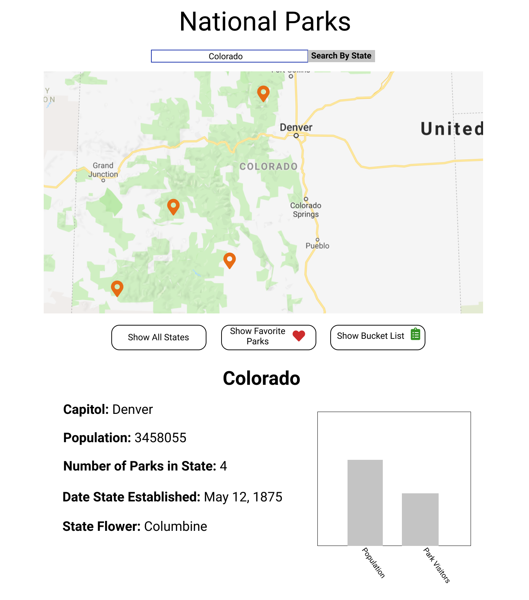

# National Parks

### See it Live!

### Set-Up Front-End:
Clone this repo
Run npm install in your terminal

### Background / About:

### Primary Technologies Used:
 - HTML
 - CSS
 - Javascript
 - React
 - Leaflet

### Test Driven Development:

### Enhancements:

### Screenshots:

### Original Assignment:
[Whateverly](http://frontend.turing.io/projects/whateverly.html) project from Turing School of Software and Design

### DTR Memo:
https://gist.github.com/trbachmann/ceb360e8cf0d946281cdba7091e4e484

### Contributors:
Karin Ohman: https://github.com/kaohman  
Adam Niedzwiecki: https://github.com/AdamN8142  
Tiffany Bachmann: https://github.com/trbachmann

### Wireframes:
 
 
 
 